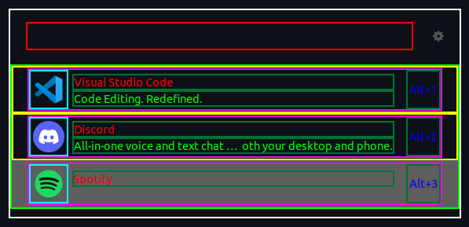

# Tron theme for ULauncher

This theme is styled based on the graphics and UI's shown in the move Tron: Legacy.
This same colour scheme and style is also taken from my [website](https://huon.dev).

## How to install

1. clone this repo:

```sh
git clone url
```

2. make sure you have the `~/.config/ulauncher/user-themes/` directory, if not create it.

3. Copy the entire `tron` folder from this project not just it's contents into the `user-themes`.

## Developer notes

I was unable to find any documentation reguarding the layout or class names of the ulauncher window so I did some investigating and made this wireframe for reference:
  
The colours are from the `template.css` file in this repo that is also at the bottom of this readme for quick access.

When spacing elements it is easy to use a negative margin to make elements closer rather than setting padding to 0.

```css
.app {
    border: 2px solid #fff; /* white */
}

.input {
    border: 2px solid #ff0000; /* red */
}

.prefs-btn {
    /* gear icon */
}

.result-box {
    border: 2px solid #00ff00; /* green */
}

.item-frame {
    border: 2px solid #0000ff; /* blue */
}

.item-box {
    border: 2px solid #ffff00; /* yellow */
}

.item-container {
    border: 2px solid #ff00ff; /* magenta */
}

.item-icon {
    border: 2px solid #00ffff; /* cyan */
}

.item-text {
    border: 2px solid #007233; /* dark green */
}

.small-result-item {
    border: 2px solid #f86401; /* orange */
}

.item-highlight {
    border: 2px solid #572e00; /* brown */
}

.item-name {
    color: #ff0000; /* red text */
}

.item-descr {
    color: #00ff00; /* green text */
}

.item-shortcut {
    color: #0000ff; /* blue text */
}

.selected {
    background-color: #5e5e5e; /* dark grey background */
}
```
